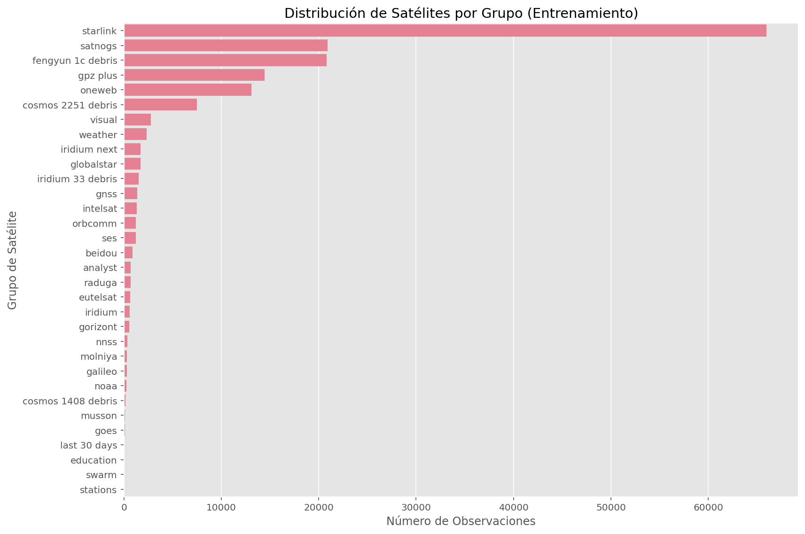

# Clasificación de Satélites por Grupo mediante Machine Learning
## Proyecto del Máster en Ingeniería de Telecomunicaciones - Asignatura de Procesado Avanzado de Señal para Multimedia - EPS/UAM

[](LICENSE)


Este proyecto desarrolla un sistema de clasificación de satélites basado en sus elementos orbitales de dos líneas (TLE). Utilizando técnicas de Machine Learning, se entrenan y evalúan diversos modelos para asignar satélites a grupos funcionales o de naturaleza similar, a partir de datos públicos de Space-Track y Celestrak.

**Desarrollado por:**
* [Miguel Carralero Lanchares](https://www.linkedin.com/in/miguel-carralero-lanchares/) <a href="https://www.linkedin.com/in/miguel-carralero-lanchares/" target="_blank"></a>
* [Luis Palomo de Onís Hernández](https://www.linkedin.com/in/luis-palomo-de-on%C3%ADs-5b1365203/) <a href="https://www.linkedin.com/in/luis-palomo-de-on%C3%ADs-5b1365203/" target="_blank"></a>

## Descripción General

El objetivo principal es construir un clasificador capaz de identificar el grupo al que pertenece un objeto espacial (satélite, debris, etc.) utilizando sus datos orbitales (TLE). Dada la complejidad de clasificar entre decenas de miles de objetos individuales, el problema se enfoca en la clasificación en subgrupos predefinidos que comparten características similares.

El flujo de trabajo incluye:
1.  **Adquisición y Preprocesamiento de Datos:** Recopilación de TLEs diarios de Space-Track y datos de grupos de Celestrak. Limpieza de datos TLE (eliminación de columnas constantes/checksums), fusión con etiquetas de grupo, y manejo de categorías problemáticas ("active", "unknown").
2.  **Balanceo de Clases:** Submuestreo de la clase mayoritaria "starlink" para mitigar el desbalanceo.
3.  **Entrenamiento de Modelos:** Implementación y entrenamiento de clasificadores como SVM, Random Forest y XGBoost. Los modelos entrenados se guardan para agilizar ejecuciones futuras.
4.  **Combinación de Modelos:** Exploración de estrategias de ensemble (promedio, máximo/mínimo de probabilidades, ponderado, votación mayoritaria) para mejorar el rendimiento.
5.  **Evaluación Exhaustiva:** Análisis de métricas como accuracy, reportes de clasificación, matrices de confusión, FAR/FRR por clase y curvas ROC/AUC.
6.  **Análisis de Importancia de Características:** Identificación de los parámetros orbitales más influyentes.

## Tecnologías Utilizadas

*   **Lenguaje:** Python 3
*   **Entorno:** Jupyter Notebook
*   **Análisis de Datos y Machine Learning:**
    *   Pandas (manipulación de datos)
    *   NumPy (cálculo numérico)
    *   Scikit-learn (preprocesamiento, modelos SVM y Random Forest, métricas, LabelEncoder, StandardScaler)
    *   XGBoost (modelo XGBClassifier)
    *   Joblib (guardado y carga de modelos)
*   **Visualización:** Matplotlib, Seaborn

## Estructura del Proyecto
```
.
+-- .gitignore
+-- .gitattributes
+-- LICENSE
+-- README.md
+-- requirements.txt
+-- DDBB/                                (Archivos CSV con datos TLE etiquetados)
| +-- 001_TLE_22ABR_J111_labelled.csv
| +-- ...                                
+-- images/                              
| +--DistribucionSatPorGrupo.png         (La imagen de distribución de grupos)
| +-- Evaluation of Individual models/   (Archivos de matrices y ROC de los modelos individuales)
    +-- ConfMat_RF.png
    +-- ConfMat_SVM.png
    +-- ConfMat_XGBoost.png
    +-- ROC_RF.png
    +-- ROC_SVM.png
    +-- ROC_XGBoost.png
| +-- Evaluation of Model Combinations/
    +-- ...                              (Archivos de matrices y ROC de combinaciones)
| +-- Importance of features/
    +-- ...                              (Archivos de importancia de características)
+-- src/
|   +-- TLETLEClasificacionSatelites.ipynb  (Notebook principal con todo el código)
|   +-- SVM_model.joblib                    (Modelo SVM pre-entrenado)
|   +-- Random_Forest_model.joblib          (Modelo Random Forest pre-entrenado)
|   +-- XGBoost_model.joblib                (Modelo XGBoost pre-entrenado)
+-- ...
```

## Instalación y Configuración

Este proyecto utiliza **Git LFS (Large File Storage)** para gestionar archivos grandes como los datasets y los modelos pre-entrenados. Siga estos pasos para una configuración correcta:

### Prerrequisitos de Git LFS

1.  **Instalar Git LFS:**
    Si aún no tienes Git LFS instalado, descárgalo e instálalo desde [git-lfs.github.com](https://git-lfs.github.com/).
    Después de instalarlo, ejecuta el siguiente comando una vez por cuenta de usuario:
    ```bash
    git lfs install
    ```

### Método 1: Configuración Manual (Recomendado para un entorno limpio)

1.  **Clonar el repositorio:**
    Al clonar, Git LFS debería descargar automáticamente los archivos grandes.
    ```bash
    git clone https://github.com/MiguelCarra/tle-satellite-classifier-python.git
    cd tle-satellite-classifier-python
    ```
    Si por alguna razón los archivos LFS no se descargan (verás archivos pequeños de texto en lugar de los datos/modelos), puedes intentar:
    ```bash
    git lfs pull
    ```

2.  **Crear un entorno virtual (recomendado):**
    ```bash
    python -m venv venv
    source venv/bin/activate  # En Windows: venv\Scripts\activate
    ```

3.  **Instalar dependencias desde `requirements.txt`:**
    Asegúrate de estar en la raíz del repositorio clonado.
    ```bash
    pip install -r requirements.txt
    ```

4.  **Datos:** Los archivos de datos en la carpeta `DDBB/` y los modelos pre-entrenados en `src/` deberían haberse descargado correctamente si Git LFS está funcionando. Verifica que los archivos `.csv` en `DDBB/` y los `.joblib` en `src/` tengan su tamaño esperado y no sean solo pequeños archivos de puntero.

### Método 2: Ejecución Directa desde el Jupyter Notebook (Más rápido para pruebas)

*   **Paso 0: Git LFS:** Asegúrate de que Git LFS esté instalado y que hayas clonado el repositorio correctamente para que los archivos de datos (`DDBB/*.csv`) y modelos (`src/*.joblib`) estén disponibles.

*   **Paso 1 (Dentro del notebook): Instalación de Dependencias**
    Descomenta y ejecuta la celda que contiene:
    ```python
    # !pip install matplotlib numpy pandas scikit-learn seaborn xgboost joblib
    ```
    *Nota: Esto instalará las librerías globalmente si no estás en un entorno virtual, o en el entorno activo del kernel de Jupyter.*

*   **Paso 2: Datos y Modelos:**
    *   Los archivos CSV en `DDBB/` y los modelos `.joblib` en `src/` deben estar presentes (descargados vía Git LFS). El notebook los cargará; si los modelos no se encuentran o no se pueden cargar (ej. si solo son punteros LFS y no el contenido real), el notebook los reentrenará.

Una vez completados estos pasos (ya sea el Método 1 o el Método 2, **asegurando que Git LFS haya funcionado**), puedes proceder a ejecutar el resto de las celdas en el notebook.

## Uso / Ejecución del Análisis

1.  Inicia Jupyter Notebook o JupyterLab:
    ```bash
    jupyter notebook
    # o
    jupyter lab
    ```
2.  Navega hasta la carpeta `src/` y abre el archivo `TLEClasificacionSatelites.ipynb`.
3.  Ejecuta las celdas del notebook en orden. El notebook:
    *   Cargará y preprocesará los datos de los archivos CSV en `DDBB/`.
    *   Realizará un análisis exploratorio básico.
    *   Preparará los datos para el modelado.
    *   Cargará los modelos SVM, Random Forest y XGBoost desde los archivos `.joblib` en `src/` si existen. Si no, los entrenará y los guardará.
    *   Evaluará los modelos individuales y combinados, mostrando métricas y gráficos.
    *   Analizará la importancia de las características.
    *   Realizará una predicción de ejemplo.

## Resultados y Demostración

Este proyecto se desarrolla íntegramente en un Jupyter Notebook, donde se pueden encontrar todos los análisis detallados, visualizaciones y la ejecución paso a paso del código. A continuación, se presenta un resumen de los resultados más destacados. Para una exploración completa, se recomienda ejecutar el notebook `src/TLEClasificacionSatelites.ipynb`.

**1. Análisis Exploratorio Inicial:**

*   **Distribución de Grupos de Satélites (Tras preprocesamiento):**
    
    *(Esta visualización, generada en la sección 3 del notebook, muestra la composición de los datos tras la limpieza inicial y el submuestreo de la clase 'starlink').*

**2. Rendimiento de los Modelos de Clasificación:**

Se entrenaron y evaluaron tres modelos individuales y cinco estrategias de combinación. Las tablas resumen las precisiones (accuracy) obtenidas en el conjunto de validación:

**Rendimiento de Modelos Individuales (Accuracy):**
```
Tabla-resumen de Accuracy - Modelos Individuales:

  Modelo                   Precisión
0 SVM (SVC)                0.8870
1 Random Forest            0.9576
2 XGBoost (XGBClassifier)  0.9935
```

**Rendimiento de Combinación de Modelos (Accuracy):**
```
Tabla-resumen de Acc. - Combinación de modelos:

  Combinación de Modelos                  Precisión
0 Combinación por promedio                0.9883
1 Combinación por máximo                  0.9891
2 Combinación por mínimos                 0.9800
3 Combinación por promedio ponderado      0.9925
4 Combinación por votación mayoritaria    0.9774
```

**3. Evaluación Detallada de los Modelos con Mejor Rendimiento:**

*   **Mejor Modelo Individual: XGBoost (Accuracy: 0.9935)**
    *   Matriz de Confusión:
        
    *   Curva ROC Multiclase:
        
    *   Importancia de Características:
        
        *(Visualizaciones generadas en las secciones 6 y 8 del notebook).*

*   **Mejor Combinación de Modelos: Promedio Ponderado de Probabilidades (Accuracy: 0.9925)**
    *   Matriz de Confusión:
        
    *   Curva ROC Multiclase:
        
        *(Visualizaciones generadas en la sección 7 del notebook).*

Para un análisis más profundo, incluyendo reportes de clasificación completos, métricas FAR/FRR por clase para todos los modelos y combinaciones, así como la predicción de un ejemplo aleatorio, por favor consulte la ejecución completa del Jupyter Notebook.

## Conclusiones y Líneas Futuras (Resumen)

*   **Mejor Modelo:** XGBoost individual (`Accuracy: 0.9935`), seguido de cerca por la combinación por promedio ponderado (`Accuracy: 0.9925`). La arquitectura de XGBoost (gradient boosting) parece adaptarse bien a la complejidad de los datos TLE.
*   **Características Clave:** La Inclinación, Movimiento Medio (Mean Motion) y Excentricidad son los parámetros orbitales más influyentes.
*   **Aplicaciones:** Clasificación automática de nuevos TLEs, apoyo a la vigilancia espacial.
*   **Limitaciones:** Dependencia de la calidad de datos TLE, clasificación a nivel de subgrupo (no individual), análisis estático de TLEs.
*   **Líneas Futuras:**
    *   Análisis de robustez de combinaciones vs. XGBoost individual con datos perturbados.
    *   Aplicación de modelos a la clase "Unknown".
    *   Incorporar análisis dinámicos de evolución orbital.

Para un análisis más detallado de las conclusiones, consulte la sección "10. Conclusiones Y Lineas de Futuro" dentro del notebook.

## Licencia

Este proyecto está bajo la Licencia MIT. Ver el archivo [LICENSE](LICENSE) para más detalles.
